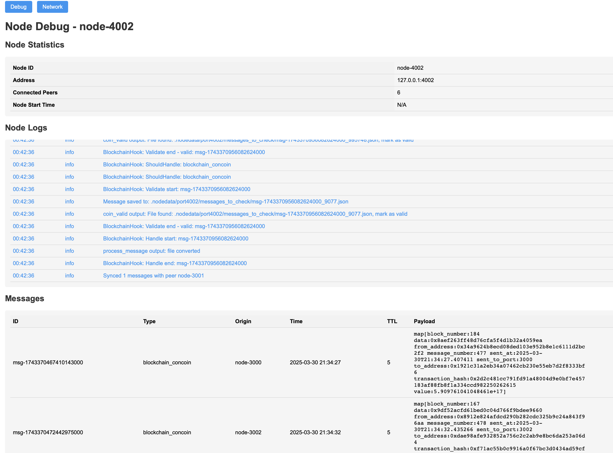

# Con-Run: Учебный проект узла децентрализованного блокчейна

Простая реализация узла децентрализованного блокчейна с использованием Gossip протокола и PEX (Peer Exchange) для учебных целей.

## Особенности

- Реализация на Go
- Gossip протокол для распространения сообщений
- PEX протокол для обмена пирами
- Локальное хранение данных в файловой системе (JSON)
- Дебаг-API для мониторинга состояния узла
- Сетевая статистика для мониторинга всей сети

## Примеры работы




## Требования

- Go 1.21+

## Установка

1. Клонировать репозиторий:

2. Установить зависимости:
   ```
   go mod download
   ```

3. Собрать проект:
   ```
   go build -o bin/node cmd/node/main.go
   ```

## Запуск

### Запуск одиночного узла

```
./bin/node --port=3000
```

### Запуск узла с подключением к seed-узлу

```
./bin/node --port=3001 --seed=3000
```

### Запуск с чистым стартом (удаление всех данных)

```
./bin/node --port=3000 --clean
```

### Подготовка скриптов
```
cd scripts
chmod +x run_nodes.sh
chmod +x run_nodes_mac.sh
chmod +x add_nodes_mac.sh
chmod +x send_test_messages.py
chmod +x send_blockchain_messages.py
```

### Запуск тестовой сети

Для Linux/Unix:
```
./run_nodes.sh
```

Для MacOS:
```
./run_nodes_mac.sh
```

### Добавление новых узлов

Для MacOS:
```
./add_nodes_mac.sh
```

### Отправка сообщений в сеть
```
./send_test_messages.py
```
или

```
./send_blockchain_messages.py
```

## Система хуков

Система хуков представляет собой механизм для обработки различных типов сообщений в con-run. Хуки позволяют удобно настраивать обработку сообщений на узле.

### Основные компоненты

- **HookManager** - центральный компонент, управляющий всеми хуками
- **Hook** - интерфейс, который должен реализовать каждый хук
- **Типы хуков**:
  - **DebugHook** - отладочный хук для логирования сообщений
  - **BlockchainHook** - хук для валидации и обработки блокчейн-сообщений (вызывает заглушки - bash скрипты)

### Жизненный цикл сообщения
1. При получении сообщения через API или синхронизацию с пирами, оно проходит через `HookManager`
2. Определяются подходящие хуки на основе типа сообщения (`messageType string`)
3. Выполняется валидация сообщения через все подходящие хуки
4. Если сообщение прошло валидацию, выполняется его обработка соответствующими хуками
5. Если ни один хук не валидировал сообщение - сообщение игнорируется и не распространяется далее по сети.

Гарантируется, что хук вызовется для каждого сообщения в сети (при подклчении новой ноды она скаивает прошлые сообщения с других нод и обрабатывает их через хуки)


### Создание собственных хуков

Для создания нового хука необходимо реализовать интерфейс `Hook`, который включает методы:

- `ShouldHandle(messageType string) bool` - определяет, должен ли хук обрабатывать сообщения данного типа
- `Validate(message *models.GossipMessage, msgType interfaces.MessageType) bool` - проверяет валидность сообщения
- `Handle(message *models.GossipMessage, msgType interfaces.MessageType) error` - обрабатывает валидное сообщение

После создания хука его необходимо зарегистрировать в `HookManager` с помощью метода `AddHook`.

### Примеры хуков

**DebugHook** - тестовый хук для логирования сообщений:
- Обрабатывает сообщения, у которых `messageType == "user_message"`
- Все сообщения считаются валидными
- Просто записывает информацию о сообщении в лог

**BlockchainHook** - хук для работы с блокчейном:
- Обрабатывает сообщения типа  `messageType == "blockchain_concoin"`
- Валидирует сообщения с помощью запуска bash скрипта `exec ./coin_valid path/to/message.json`
- Обрабатывает сообщения с помощью bash скрипта `exec ./process_message path/to/message.json`


## Холодный старт

При первом запуске или после очистки данных (флаг `--clean`), узел выполняет следующие действия:

1. Создает необходимые директории для хранения данных
2. Инициализирует конфигурацию узла
3. Подключается к seed-узлам (если указаны)
4. Начинает обмен пирами через PEX протокол
5. Синхронизирует сообщения с подключенными пирами (запрашивает у пиров список сообщений и скачивает сообщения, которые у него отсутствуют)

## Хранение данных

### Сообщения

Сообщения хранятся в директории `.nodedata/port<port>/messages/` в формате JSON. Каждое сообщение сохраняется в отдельный файл с именем `<message_id>.json`. Сообщения содержат:
- ID сообщения
- ID отправителя
- Временную метку
- TTL (время жизни)
- Тип сообщения
- Полезную нагрузку

### Пиры

Информация о пирах хранится в директории `.nodedata/port<port>/peers/` в формате JSON. Каждый пир сохраняется в отдельный файл с именем `<node_id>.json`. Для каждого пира хранится:
- ID узла
- Адрес
- Время последнего обращения

### Конфигурация

Конфигурация узла хранится в файле `.nodedata/port<port>/config/config.json` и содержит:
- ID узла
- Порт
- Seed-узлы
- Параметры Gossip протокола
- Параметры PEX протокола

## Структура проекта

```
.
├── cmd/
│   └── node/                  # Точка входа приложения
├── pkg/
│   ├── api/                   # HTTP API и веб-интерфейс
│   ├── config/                # Конфигурация
│   ├── gossip/                # Gossip протокол
│   ├── hooks/                 # Система хуков для обработки входящих сообщений
│       └── blockchain_tools/  # Хуки для системы блокчейна (sh-заглушки)
│   ├── interfaces             # Интерфайсы
│   ├── models/                # Модели данных
│   ├── pex/                   # PEX протокол
│   └── storage/               # Хранение данных
└── scripts/                   # Скрипты для запуска тестовой сети
```

## API

### Дебаг интерфейс

```
http://localhost:<port>/debug
```

Отображает:
- Статистику узла
- Количество подключенных пиров
- Логи работы узла
- Все сообщения на узле

### Сетевая статистика

```
http://localhost:<port>/network
```

Отображает:
- Информацию о локальном узле
- Список всех известных пиров
- Статус подключения каждого пира
- Ссылки на дебаг-интерфейсы других узлов

### API узла


#### Получение списка сообщений
```
GET http://localhost:<port>/messages
```

#### Получение конкретного сообщения
```
GET http://localhost:<port>/messages/<message_id>
```

#### Добавление нового сообщения сторонним пользователем
```
POST http://localhost:<port>/add_message
Content-Type: application/json

{
   "type": "user_message",
   "payload": {"text": "New message"}
}
```

